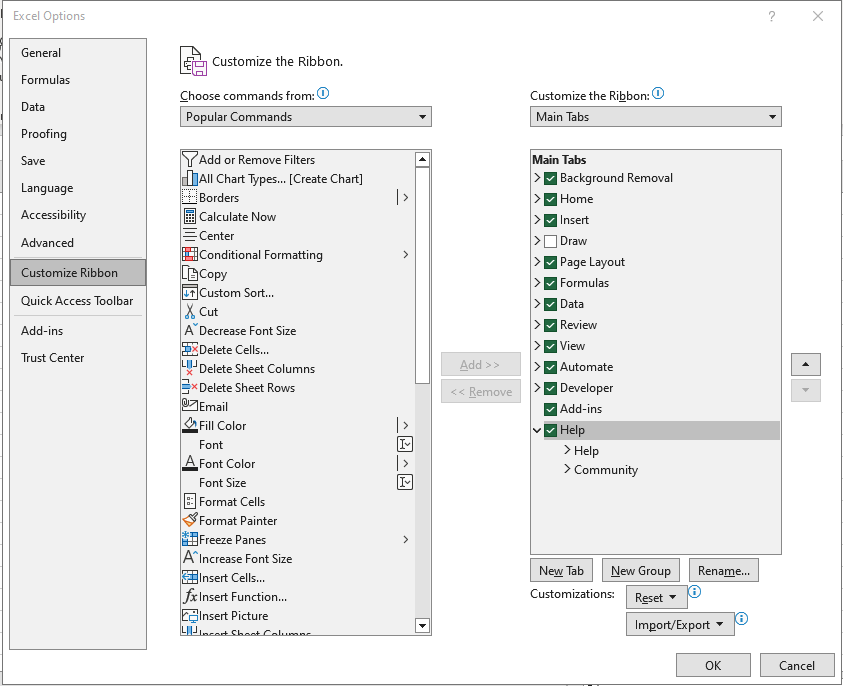
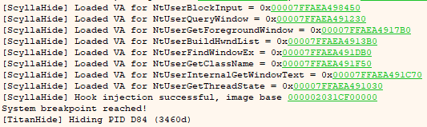
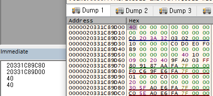

# Environment
Microsoft Excel: Office 16

Windows 10: 20H2(OS Build 19042.1526)

x64dbg: Dec 12 2022

# Enable to Developer menu

We should enable the Developer menu in Ribbon options.

- File → Options → Customize Ribbon → Customize the Ribbons → Check to Developer

{: .normal }

# Attach to Excel.exe through x64dbg

If you attach a clean version of x64dbg, you can see too many exception break. It’s caused by windows' security policy. such as DEP and others.

To overcome these hurdles, we must prepare as follows.

- Disable DEP in Windows
- x64dbg Anti-Anti-Debug plugin: [ScyllaHide](https://github.com/x64dbg/ScyllaHide), [TitanHide](https://github.com/mrexodia/TitanHide)

{: .normal }

After that, you won’t see any unintened exceptions.

# Open Excel.exe with x64dbg

I recommend opening with a debugger to get full right from the debugged. and it's more comfortable because we have to frequently restart the action.

Then, we can test many codes under x64dbg. VBA doesn't comfortable for debugging. It hasn't full debugging options and the pointer fundamental. so, this task is more helpful to your explorer.

{: .normal }
